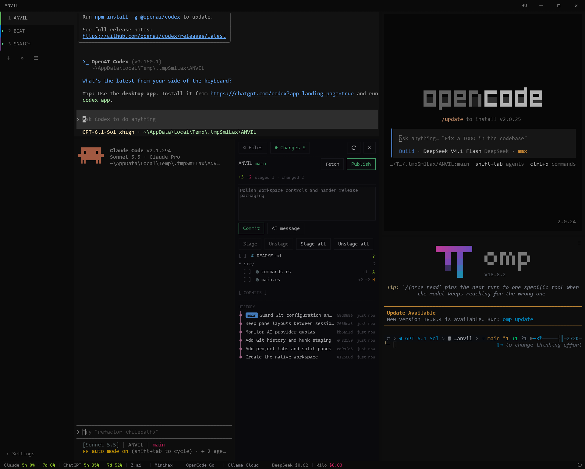

<p align="center"></p>

<h1 align="center">ANVIL</h1>

<p align="center"><strong>A lightweight Windows terminal for multiple CLI agents.<br>Project tabs, movable split panes, Git and AI quotas in one workspace.</strong></p>

<p align="center">
  <a href="https://github.com/RERCON0/ANVIL/actions/workflows/ci.yml"></a>
  <a href="https://github.com/RERCON0/ANVIL/actions/workflows/security.yml"></a>
  <a href="https://github.com/RERCON0/ANVIL/releases"></a>
  <a href="https://github.com/RERCON0/ANVIL/releases"></a>
  <a href="LICENSE"></a>
  <a href="https://t.me/rercon"></a>
</p>

<p align="center"><a href="README.ru.md">Русский</a> · <a href="https://github.com/RERCON0/ANVIL/releases">Download</a> · <a href="#features">Features</a> · <a href="#build">Build</a> · <a href="#keyboard-shortcuts">Shortcuts</a> · <a href="docs/RELEASING.md">Release verification</a></p>



<p align="center"><sub>Real CLI sessions in a sample workspace. Git history, staging and commit controls stay next to the agents.</sub></p>

## Why ANVIL

Keep each project in its own tab, then open Codex, Claude Code, OpenCode, OMP
or a shell in separate panes. Split, move, collapse or close panes as you work;
each keeps its running process and working directory. Review changes and commit
from the adjacent Git panel, without switching to a separate IDE.

ANVIL focuses on a small native application, rich terminal functionality and
quick access to the work. The interface uses Rust, egui and OpenGL; shells run
through ConPTY from Windows Terminal.

## Features

| Workspace | What you can do |
|---|---|
| Project tabs | Name, colour, reorder and switch between projects |
| Split panes | Split right/down, move running sessions, navigate with the keyboard, maximise or collapse |
| Git panel | Inspect changes and history, stage files or individual hunks, edit AI-assisted commit messages, commit, fetch and push |
| File browser | Filter files, preview text and Markdown, create, rename and send files to the Recycle Bin |
| AI quotas | View usage windows, reset times, balances or spending for 19 providers; windows share one polling worker |
| Claude Code | Optional statusLine and tab badge with model, context usage, limits and agent |
| Terminal | Truecolor, OSC 8 links, search, mouse modes, bracketed paste, font fallback, grid-aligned block/Braille graphics |
| Saved workspace | Restore tabs, folders, splits and panel state; choose English or Russian in the title bar |

> [!IMPORTANT]
> Layouts are restored; shells start again. Live CLI processes and terminal scrollback are not saved between application launches.

AI commit messages support Codex, Claude, OpenCode, Gemini and Aider. External
backends require their CLI installations. The generated message remains editable.

> [!CAUTION]
> Generating a commit message sends the staged diff to your AI provider. Check the index for credentials and other private data before using it.

## Get started

Requires **Windows 10/11 x64**, an OpenGL 2.1-capable graphics driver and a shell.
Install Git for Windows for the Git panel, and your preferred external AI CLIs
separately. Codex commit messages can use an existing Codex login or an API key.

1. Download the ZIP from [Releases](https://github.com/RERCON0/ANVIL/releases).
2. Extract the whole archive and run `anvil.exe`. Keep the runtime and helper files beside it.
3. Open a project folder, then split the tab to run several agents or shells.
4. Enable the quotas and Claude statusLine you want in Settings. Click **RU/EN** in the title bar to switch language.

> [!NOTE]
> Releases carry an Ed25519 signature covering the package files. This is separate from Windows Authenticode, so SmartScreen may still warn. If you trust the download source, choose **More info → Run anyway**. Verification instructions and the trusted key fingerprint are in [RELEASING](docs/RELEASING.md).

> [!TIP]
> Enable **Settings → Claude Code → ANVIL status line** to see session context. The confirmation shows the settings change. Update the helper path after moving ANVIL, and disable the integration before removing it.

## Security built into the workflow

Git settings that can execute programs require explicit trust; that approval
expires when the relevant configuration changes. Git and AI jobs in the panel
have deadlines, bounded output and process-tree cleanup. Credential reads,
file previews and metadata traversal are bounded; AI diagnostics redact known
secrets. Quota keys use Windows Credential Manager, and DLL lookup is restricted
to the application directory and system locations.

CI checks real ConPTY sessions, Git integration, package contents and PE
mitigations. Security checks the locked dependency graph, complete Git history
for secrets and the workflows themselves. See [SECURITY](SECURITY.md) for the
enforcement details and remaining limits.

## Build

Install Git, rustup and **Visual Studio Build Tools** with C++ tools and the
Windows SDK. [rust-toolchain.toml](rust-toolchain.toml) pins Rust 1.92.0,
rustfmt and Clippy. PowerShell, from the repository root:

```powershell
cargo build --locked --release --bin anvil --bin anvil-claude-status
.\target\release\anvil.exe
```

For an unsigned development package with runtime files, licences and build
provenance, install Python 3.13 and run:

```powershell
powershell -ExecutionPolicy Bypass -File scripts\package.ps1
# dist\anvil-<version>-x64.zip
```

Publisher signing uses a separate clean-build procedure in
[RELEASING](docs/RELEASING.md). The CI artifacts remain explicitly unsigned.
Python is needed for development scripts and release verification, not to run ANVIL.

```powershell
cargo fmt --all -- --check
cargo clippy --locked --all-targets -- -D warnings
cargo test --locked --all-targets
python -B -m unittest discover -s tests -p 'test_*.py' -v
python -B -m unittest discover -s scripts -p 'test_*.py' -v
python -B scripts/check_conpty.py
python -B scripts/check_docs.py
```

## Keyboard shortcuts

| Action | Keys |
|---|---|
| New tab / window | `Ctrl+Shift+T` / `Ctrl+Shift+N` |
| Close / restore tab | `Ctrl+Shift+W` / `Ctrl+Shift+Z` |
| Next / previous tab | `Ctrl+Tab` / `Ctrl+Shift+Tab` |
| Split right / down | `Ctrl+Shift+S` / `Ctrl+Shift+D` |
| Navigate panes | `Ctrl+Alt+Arrow keys` |
| Move a pane | `Ctrl+Shift` + drag its label |
| Maximise a pane | `Ctrl+Alt+Enter` |
| Collapse / restore pane | `Ctrl+Alt+C` / `Ctrl+Alt+R` |
| Collapsed pane list | `Ctrl+Alt+L` |
| Git panel / search | `Ctrl+Shift+G` / `Ctrl+Shift+F` |
| Copy / paste | `Ctrl+Shift+C` / `Ctrl+Shift+V` |
| Settings / fullscreen | `Ctrl+,` / `F11` |

Shortcuts use physical keys and work across keyboard layouts. Rebind them in Settings.

## Data and documentation

| Location | Data |
|---|---|
| `%APPDATA%\anvil` | `config.json`, saved `session.json`, `anvil.log` |
| `%LOCALAPPDATA%\anvil` | Shared quota cache, polling schedule and temporary Claude statuses |
| Windows Credential Manager | Quota API keys: `anvil/quota/<provider>` |

- [Detailed feature and configuration reference (Russian)](docs/REFERENCE.md)
- [Security policy and limitations](SECURITY.md)
- [Release signing and verification](docs/RELEASING.md)
- [Audit findings and checks](docs/AUDIT.md)
- [Third-party resources and licences](THIRD-PARTY.md)
- [ConPTY provenance](vendor/conpty/README.md)

Licensed under [GPL-3.0-or-later](LICENSE). By rercon prod.
