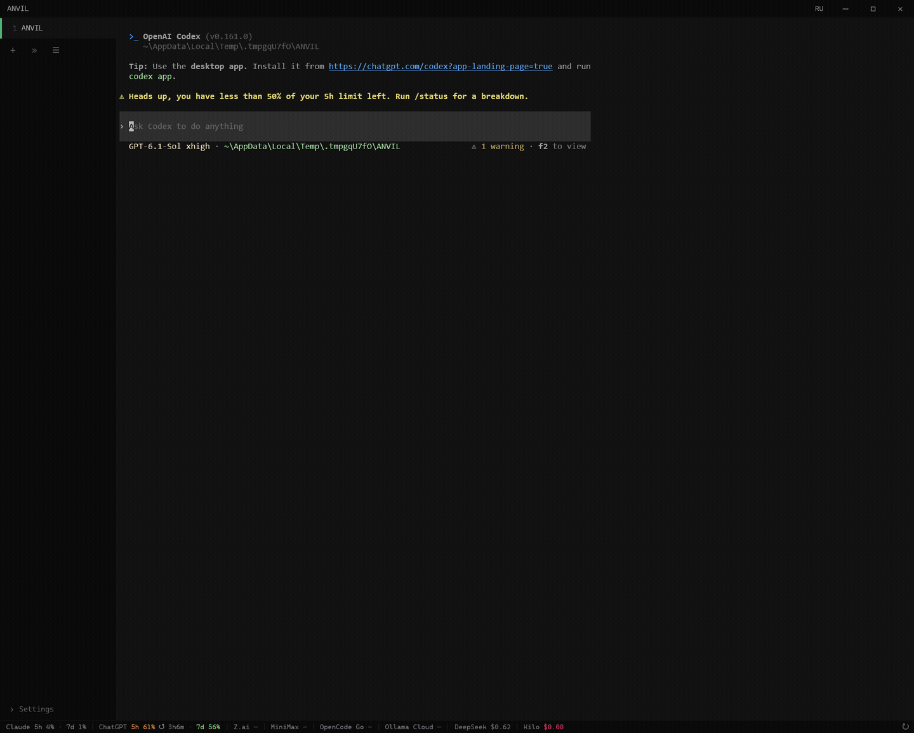

<p align="center"></p>

<h1 align="center">ANVIL</h1>

<p align="center"><strong>Лёгкий терминал для Windows и работы с несколькими CLI-агентами.<br>Вкладки проектов, подвижные сплиты, Git и квоты ИИ в одном рабочем пространстве.</strong></p>

<p align="center">
  <a href="https://github.com/RERCON0/ANVIL/actions/workflows/ci.yml"></a>
  <a href="https://github.com/RERCON0/ANVIL/actions/workflows/security.yml"></a>
  <a href="https://github.com/RERCON0/ANVIL/releases"></a>
  <a href="https://github.com/RERCON0/ANVIL/releases"></a>
  <a href="LICENSE"></a>
  <a href="https://t.me/rercon"></a>
</p>

<p align="center"><a href="README.md">English</a> · <a href="https://github.com/RERCON0/ANVIL/releases">Скачать</a> · <a href="#возможности">Возможности</a> · <a href="#сборка">Сборка</a> · <a href="#горячие-клавиши">Горячие клавиши</a> · <a href="docs/RELEASING.md">Проверка подписи</a></p>



<p align="center"><sub>10 секунд настоящей работы: вкладки, четыре CLI-агента, Git и перенос живого пейна. Агенты предварительно запущены для записи; это не замер запуска. <a href="assets/workspace.png">Полный скриншот</a>.</sub></p>

## Зачем ANVIL

Каждому проекту — своя вкладка, а внутри неё Codex, Claude Code, OpenCode, OMP
или обычные оболочки в отдельных панелях. На ходу делите пространство,
переставляйте, сворачивайте и закрывайте панели; каждая сохраняет запущенный
процесс и рабочую папку. Просматривайте изменения и делайте коммиты в соседней
Git-панели, без перехода в отдельную IDE.

Главное в ANVIL — малый вес, богатые возможности терминала и быстрый доступ к
работе. Интерфейс написан на Rust с egui/OpenGL, оболочки работают через ConPTY
из Windows Terminal.

### Вдохновение Tabby

Спасибо [Tabby](https://github.com/Eugeny/tabby) и его разработчикам: дизайн
ANVIL, несколько окон внутри каждой вкладки и многие горячие клавиши вдохновлены
их работой. В ANVIL эти идеи реализованы на Rust/egui и дополнены Git-панелью
и квотами ИИ внизу окна. Основной сценарий — рабочие инструменты вроде
OpenCode, Codex и Claude Code.

Сам Tabby прямо пишет в [README](https://github.com/Eugeny/tabby#what-tabby-is-and-isnt),
что не является лёгким терминалом. ANVIL делает упор на лёгкое рабочее
пространство для Windows; память зависит от числа пейнов, истории вывода
и загруженных запасных шрифтов.

### Сравнение с Windows Terminal и WezTerm

[Windows Terminal](https://learn.microsoft.com/en-us/windows/terminal/panes) уже
умеет вкладки и сплиты. [WezTerm](https://wezterm.org/features.html) дополнительно
предлагает разные ОС, удалённую работу и мультиплексирование. ANVIL объединяет
Git, файлы, стейджинг ханков, редактируемые ИИ-коммиты и квоты в Windows-интерфейсе
для нескольких CLI-агентов. Он подходит, когда эти действия помогают реже
переключаться в другое приложение; удалённый мультиплексор и полноценную IDE он
не заменяет.

### Измеренная память

Локальный замер релизной сборки: около **36 МиБ** частной рабочей памяти с
пустой оболочкой и **135 МиБ** с Codex, OpenCode и одной Git-панелью.
Четыре вкладки, 20 пейнов и 2,16 млн цветных Unicode-строк дали пик **1,31 ГиБ**
при стандартной истории. Сокращение истории с 25 000 до 1 000 строк на пейн
снизило память до **261 МиБ**. Здесь измеряется ANVIL; внешние агенты используют
дополнительную память. [Условия, счётчики и воспроизведение](docs/PERFORMANCE.md).

## Возможности

| Инструмент | Что умеет |
|---|---|
| Вкладки проектов | Названия, цвета, перестановка и переключение проектов |
| Сплиты | Вправо и вниз, перенос живых сессий, навигация с клавиатуры, максимизация и сворачивание |
| Git-панель | Изменения и история, стейджинг файлов или ханков, переключение и создание веток, редактируемый AI-коммит, commit, fetch и push |
| Дерево файлов | Фильтр, предпросмотр текста и Markdown, создание, переименование и удаление в корзину |
| Квоты ИИ | Окна лимитов, время сброса, баланс или расходы для 19 провайдеров; общий опрос между окнами |
| Claude Code | Отдельно включаемые statusLine и бейдж вкладки: модель, контекст, лимиты и агент |
| Терминал | Truecolor, OSC 8-ссылки, поиск, мышь, bracketed paste, шрифтовый fallback, блочная графика и Braille по сетке |
| Сохранение | Вкладки, папки, сплиты и состояние панелей; английский и русский переключаются в шапке |

> [!IMPORTANT]
> Восстанавливается раскладка, оболочки запускаются заново. Живые процессы CLI и скроллбек между запусками приложения не сохраняются.

Генерация сообщений коммита поддерживает Codex, Claude, OpenCode, Gemini и
Aider. Для внешних бэкендов нужны установленные CLI. Предложенный текст остаётся
на редактирование.

> [!CAUTION]
> При генерации сообщения staged-diff отправляется AI-провайдеру. Перед вызовом проверьте индекс: ключи, токены и другие приватные данные не должны попасть в запрос.

В **Настройки → Терминал** есть отдельное восстановление CLI-агентов с
продолжением последней беседы: Codex, Claude Code, OpenCode и OMP. По умолчанию
выключено; требуется восстановление раскладки. Каждый CLI выбирает последнюю
беседу своей папки, поэтому два одинаковых агента в одной папке могут открыть
одну беседу. Выполнявшаяся задача и скроллбек не возобновляются.

Для генерации коммита через Claude требуется **Claude Code 2.1.248+**.
Генерация через ChatGPT-вход Codex — отдельная экспериментальная опция; штатный
вариант использует API-ключ. Подробности — в [справочнике](docs/REFERENCE.md).

## Запуск

Нужны **Windows 10/11 x64**, видеодрайвер с OpenGL 2.1 и оболочка. Для
Git-панели установите Git for Windows; внешние AI-CLI устанавливаются отдельно.
Codex использует API-ключ; ChatGPT-вход для генерации включается отдельно как экспериментальная опция.

1. Скачайте ZIP из [Releases](https://github.com/RERCON0/ANVIL/releases).
2. Распакуйте весь архив и запустите `anvil.exe`. Runtime и helper оставьте рядом.
3. Откройте папку проекта и разделите вкладку для нескольких агентов или оболочек.
4. В настройках включите нужные квоты и Claude statusLine. **RU/EN** в шапке переключает язык.

> [!NOTE]
> Релизы имеют подпись Ed25519, покрывающую файлы пакета. Это отдельная подпись, а не Windows Authenticode: SmartScreen всё ещё может показать предупреждение. Если вы доверяете источнику, выберите **Подробнее → Выполнить в любом случае**. Проверка и отпечаток доверенного ключа описаны в [RELEASING](docs/RELEASING.md).

> [!TIP]
> **Настройки → Claude Code → Строка статуса от ANVIL** подключает контекст сессии. Диалог показывает изменение настроек. После переноса программы обновите путь к helper, перед удалением отключите интеграцию.

## Защита в рабочем процессе

Git-настройки, способные запускать программы, требуют явного доверия;
разрешение сбрасывается при изменении опасной конфигурации или содержимого хуков. Стандартные `.git/hooks`, пользовательские хуки и подмодули тоже проверяются. Git- и AI-задания
панели имеют дедлайны, ограниченный вывод и очистку дерева процессов. Чтение
учётных данных, предпросмотр файлов и обход метаданных ограничены; известные
секреты скрываются в диагностике ИИ. Ключи квот хранятся в Диспетчере учётных
данных Windows, поиск DLL ограничен каталогом программы и системными путями.

CI проверяет настоящие ConPTY-сессии, Git, состав пакета и PE-защиты. Security
проверяет зависимости, всю историю Git на секреты и сами workflow.
Детали и оставшиеся ограничения — в [SECURITY](SECURITY.md).

## Сборка

Нужны Git, rustup и **Visual Studio Build Tools** с C++ и Windows SDK.
[rust-toolchain.toml](rust-toolchain.toml) закрепляет Rust 1.92.0, rustfmt и
Clippy. Из корня репозитория в PowerShell:

```powershell
cargo build --locked --release --bin anvil --bin anvil-claude-status
.\target\release\anvil.exe
```

Команда Cargo выше — сборка для разработки. Для неподписанного пакета с
удалением путей сборщика, детерминированными флагами линкера, runtime,
лицензиями и сведениями о сборке установите Python 3.13 и выполните:

```powershell
powershell -ExecutionPolicy Bypass -File scripts\package.ps1
# dist\anvil-<версия>-x64.zip
```

Подписанный релиз собирается отдельно из чистых исходников по
[RELEASING](docs/RELEASING.md). Артефакты CI явно помечены как unsigned.
Python нужен для скриптов разработки и проверки релиза, запускать ANVIL можно без него.

```powershell
cargo fmt --all -- --check
cargo clippy --locked --all-targets -- -D warnings
cargo test --locked --all-targets
python -B -m unittest discover -s tests -p 'test_*.py' -v
python -B -m unittest discover -s scripts -p 'test_*.py' -v
python -B scripts/check_conpty.py
python -B scripts/check_docs.py
```

## Горячие клавиши

| Действие | Клавиши |
|---|---|
| Новая вкладка / окно | `Ctrl+Shift+T` / `Ctrl+Shift+N` |
| Закрыть / вернуть вкладку | `Ctrl+Shift+W` / `Ctrl+Shift+Z` |
| Следующая / предыдущая вкладка | `Ctrl+Tab` / `Ctrl+Shift+Tab` |
| Сплит вправо / вниз | `Ctrl+Shift+S` / `Ctrl+Shift+D` |
| Соседний пейн | `Ctrl+Alt+Стрелки` |
| Переставить пейн | `Ctrl+Shift` + перетаскивание ярлыка |
| Максимизировать пейн | `Ctrl+Alt+Enter` |
| Свернуть / вернуть пейн | `Ctrl+Alt+C` / `Ctrl+Alt+R` |
| Список свёрнутых пейнов | `Ctrl+Alt+L` |
| Git-панель / поиск | `Ctrl+Shift+G` / `Ctrl+Shift+F` |
| Копировать / вставить | `Ctrl+Shift+C` / `Ctrl+Shift+V` |
| Настройки / полный экран | `Ctrl+,` / `F11` |

Сочетания привязаны к физическим клавишам и работают независимо от раскладки.
Их можно изменить в настройках.

## Данные и документация

| Каталог | Содержимое |
|---|---|
| `%APPDATA%\anvil` | `config.json`, раскладка `session.json`, `anvil.log` |
| `%LOCALAPPDATA%\anvil` | Общий кэш квот, расписание опроса и временные статусы Claude |
| Диспетчер учётных данных Windows | Ключи квот: `anvil/quota/<провайдер>` |

- [Справочник возможностей и настроек](docs/REFERENCE.md)
- [Безопасность и ограничения](SECURITY.md)
- [Подпись и проверка релизов](docs/RELEASING.md)
- [Находки аудита и проверки](docs/AUDIT.md)
- [Измерения памяти и нагрузочный тест](docs/PERFORMANCE.md)
- [Сторонние ресурсы и лицензии](THIRD-PARTY.md)
- [Происхождение ConPTY](vendor/conpty/README.md)

Лицензия — [GPL-3.0-or-later](LICENSE). Автор — rercon prod.

Таблица сочетаний содержит выбранные действия; полный список доступен в настройках.
[English reference](docs/REFERENCE.en.md) · [Разбор аудитов](docs/AUDIT-REVIEW.md) · [План обновления зависимостей](docs/DEPENDENCIES.md).
